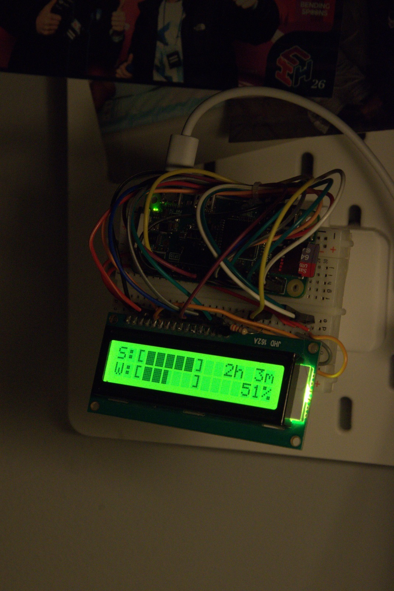
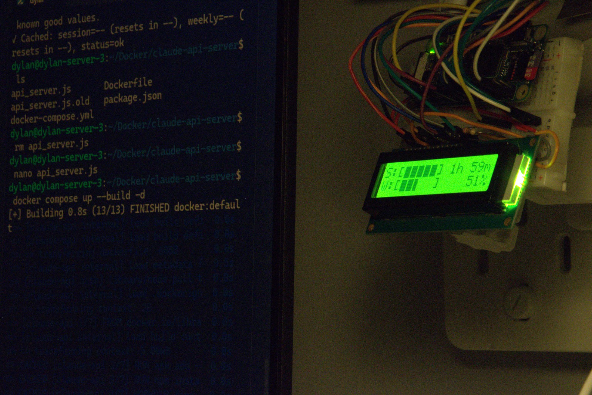

# ClaudeDisplay

Use a 16x2 LCD with a Raspberry Pi Zero W, along with a Docker container on another computer to make a live Claude usage meter.

Run the docker-compose in `server` and then run the rpi script on a raspberry pi zero w.

